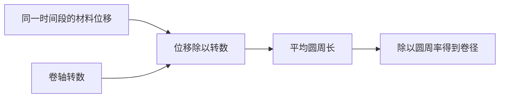

# 面向阅读的排版

## 把视觉层次用于解释

开头用一句话说明本页解决的问题，再以简短导语给出关键认识。正文让标题、推导、公式、图和对应例子靠在一起；概念解释不塞进宽表格。一个提示块只承担一个作用，例如关键结论、误解或适用条件。

借鉴 AI_Animation 的 scholar-notes：分层标题、少量高亮、过程图、对比区、旁注与具体例子。迁移的是阅读方法，不是皮革封面、固定纸高、在线字体和每段入场动画。中文正文应清楚易读；不为了装饰删掉必要内容。

色彩承担稳定语义并配合文字标签，不只靠颜色区分意义。优先跟随思源主题，用其颜色变量；避免在浅色主题写死白字、在深色主题写死黑字。图标点缀标题或导航即可，遵循当前工作区偏好；不用外部模板的“禁止 emoji”覆盖思源的文档图标习惯。

## 内容与思源结构的对应

| 阅读目的 | 合适的原生结构 | 使用判断 |
| --- | --- | --- |
| 概念与推导 | 标题、段落、行内强调、公式块 | 默认正文，保持连贯 |
| 易错点或关键认识 | NOTE/TIP/WARNING 等提示块 | 有值得突出的内容再用 |
| 少量同维度比较 | Markdown 表格 | 每格短；长解释放回正文 |
| 两种思路并排 | 超级块 | 宽度足够时使用；窄屏考虑上下排列 |
| 因果、流程、交互 | Mermaid 等渲染代码块 | 图中每条边要有明确含义 |
| 可复用概念 | 真实块引用与有意义的锚文本 | 已确认目标存在 |
| 动态学习目录 | 查询嵌入或属性视图 AV | 确实需要过滤、排序、字段管理时使用 |
| 回忆训练 | 问题与解释；按需注册闪卡 | 先有好问题，不能仅高亮就声称已建卡 |

编写时读取的 Sisyphus 帮助确认以下语法；其他客户端或版本按当前帮助确认。

````markdown
> [!TIP]
> 先解释这个结论为什么有用，再给具体例子。


````

超级块的横向两列使用外层 `col`、每列内层 `row`。通过 document/block 等支持原生结构的操作写入，并查看真实块树，不能只依赖 Markdown 导出。

```text
{{{col
{{{row
## 观察到的现象

一段连贯的解释。
}}}
{{{row
## 解释它的原理

对应的因果关系与例子。
}}}
}}}
```

## Obsidian 迁移要点

借鉴概念页、主题入口、少量元数据和知识关联。将 `[[名称]]` 映射到查到真实 ID 的思源块引用，将 `#tag` 映射到 `#tag#`；不要原样搬 `.base`、Dataview 查询、Obsidian 块 ID 或主题 CSS。Callout 虽有相似语法，仍以目标思源的支持情况为准。

## 交互讲解是可选补充

当改变参数、观察阶段或手动步进确实能帮助理解时，可以制作独立 HTML 讲解，并在思源正文保留完整的核心解释。采用清楚的中文标签、暂停/重置、键盘可用的控制；尊重减少动态效果的偏好。

HTML、iframe、挂件能否执行脚本、装载外部资源受客户端与环境影响，不能由“支持 HTML 块”推出“完整网页可直接运行”。用户未要求时不安装主题/插件、不改全局 CSS、不上传资产；需要时使用已授权路径，写后验证实际显示。图示能用原生 Mermaid 清楚表达时，无需制作动画网页。
